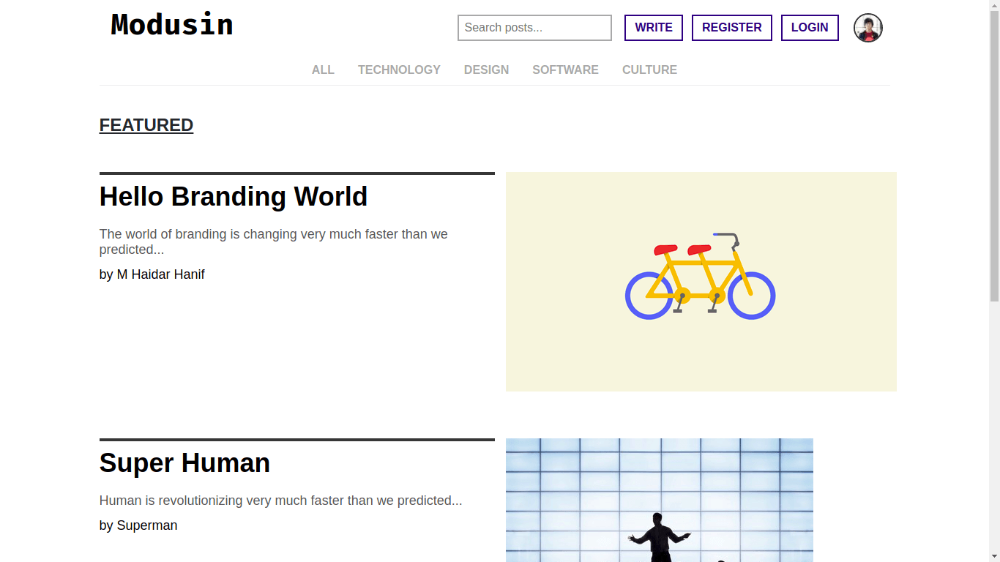

# Modusin Web with React

> Modusin is a publishing network for learners

The goal of this app is to clone a [Medium](https://medium.com) web app, called [Modusin](https://modusin.com).



## Tech Stack

- Node.js
- React.js
- React Router
- React Redux
- Redux
- Redux Thunk / Redux Saga
- Netlify
- CloudFlare
- Uniregistry

## App Structure

### React: View

- `src`
  - `index.js`: configures the whole React + Router + Redux
  - `App.js`: sets the routes for `pages`
  - `styles`: all global styles
    - `*.css`
  - `templates`: wraps `pages` components
    - `*.js`: usually formatted as `Layout*`
  - `pages`: contains `large` components
    - `*.js`
  - `large`: contains `medium` components
    - `*.js`
  - `medium`: contains `small` components
    - `*.js`
  - `small`: contains primitive DOM components
    - `*.js`
    
### Redux: Store + Reducers + Actions

- `redux`
  - `stores`
  - `reducers`
  - `actions`
  - `containers`

--------------------------------------------------------------------------------

## Development

### Installing

Install `yarn` with `npm`

```sh
npm install -g yarn
yarn install
```

### Running

```sh
yarn dev
```

### Building

```sh
yarn build
```

--------------------------------------------------------------------------------

## Deployment

### Application

`node` => `react` => `react-scripts` => `react-app-rewired`

### Infrastructure

GitHub => Netlify => CloudFlare => mhaidarhanif.org/modusin.com

### Running

```sh
yarn deploy
```

--------------------------------------------------------------------------------

## Component Architecture

### Pages

| Route       | Component
|-------------|----------
| `/`         | home
| `/post/:id` | post
| `/register` | register
| `/login`    | login
| `/profile`  | profile
| `/setting`  | setting

### Size

#### Small

- Logo
- Topic
- SearchBox
- ActionButton
- ActionAvatar
- SectionTitle
- PostTitle
- PostImage
- PostSnippet
- Avatar
- MetaText
- MetaTextSmall
- FooterText
- ActionInput

#### Medium

- PageTitle
- PageSubtitle
- PageText
- ActionBar
  - SearchBox
  - ActionButton
  - ActionAvatar
- TopicTags
  - Array of Topic
- FeaturedPost
  - PostTitle
  - PostImage
  - PostSnippet
  - MetaText
- SmallPost
  - PostTitle
  - PostImage
  - PostSnippet
  - MetaText
  - MetaTextSmall
- ProfileBar
  - Avatar
  - MetaText
  - MetaTextSmall
- FooterTexts
  - FooterText

#### Large Segments

- SegmentNavigationHeader
  - Logo
  - ActionBar
  - TopicTags
- SegmentFeaturedPosts
  - Array of FeaturedPost
- SegmentLatestPosts
  - Array of SmallPost
- SegmentPostContent
  - ProfileBar
  - PostTitle
  - PostImage
  - PostTextContent

#### Templates

- Provider
- Router
- PageCommon
- PagePost

--------------------------------------------------------------------------------

## License

[MIT License](./LICENSE)
